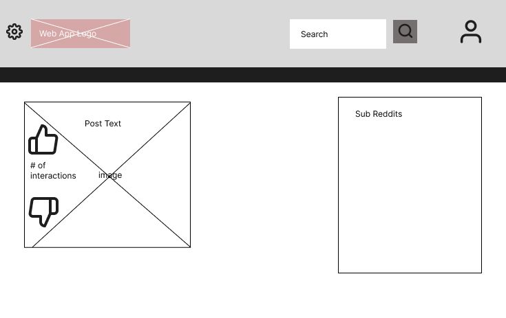
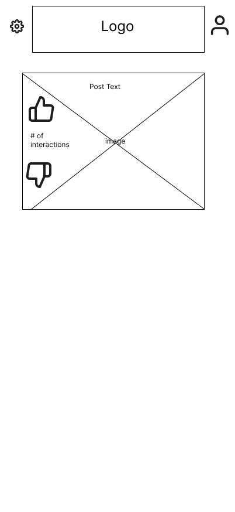

# Reddit Mini

A Reddit-style client built with React, Vite, Redux Toolkit, React Router, and Bootstrap.  
The current version focuses on a clean UI shell, route-based navigation, and consistent component styling while data/API integration is prepared.

## Wireframes

### Desktop


### Mobile


## Technologies Used

- React 19
- Vite 8
- Redux Toolkit
- React Redux
- React Router
- Bootstrap 5
- React Bootstrap
- ESLint 9

## Features

- Route-based pages for:
  - Home
  - Posts
  - Explore
  - Not Found
- Right-side sidebar with subreddit-focused cards
- Posts-first Home page
- Responsive Bootstrap grid/card layout
- Consistent app color theme matched to branding/logo color (`#98B539`)
- Redirect support from `/subreddits` to `/explore`
- Reusable feature-first project structure (`features/`, `shared/`, `app/`)

## Project Structure

- `src/app` - Redux store and root reducer
- `src/features` - feature-specific slices/components/pages/api stubs
- `src/shared` - shared UI components, API stubs, hooks, styles, and utilities
- `src/pages` - route-level pages

## Getting Started

1. Install dependencies:
   ```bash
   npm install
2. Run the project
   npm run dev (in dev environment)
   npm run build (build for production)
   npm run preview (preview production build)