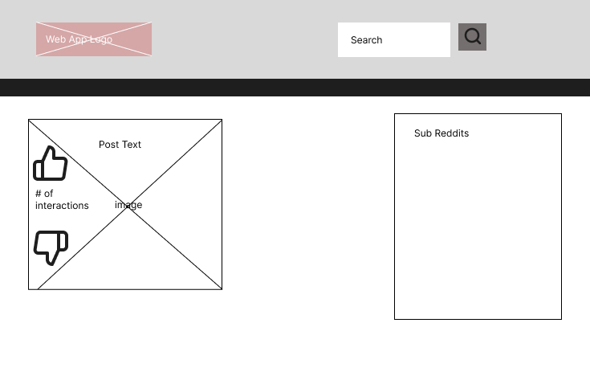
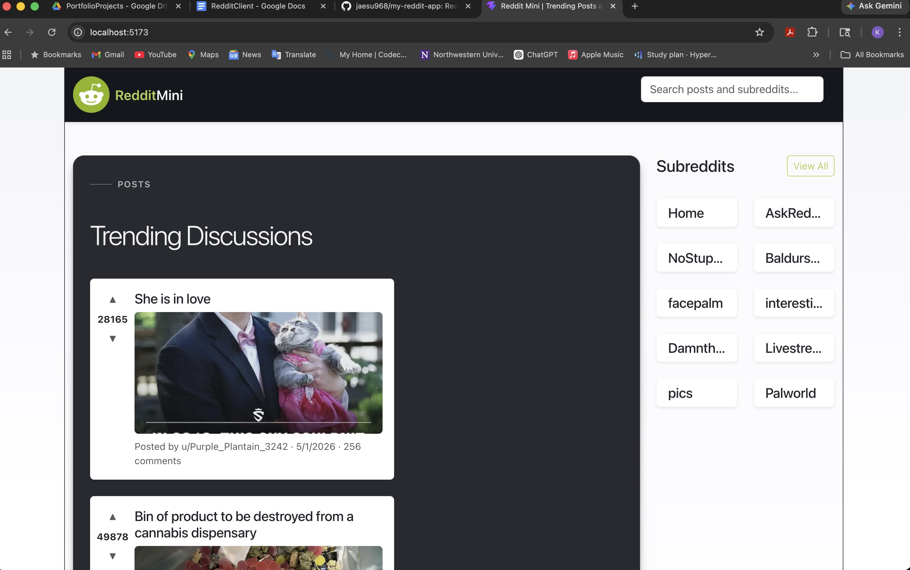
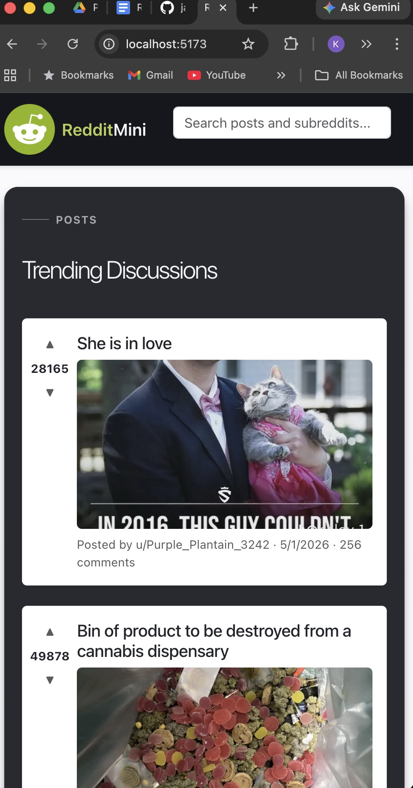
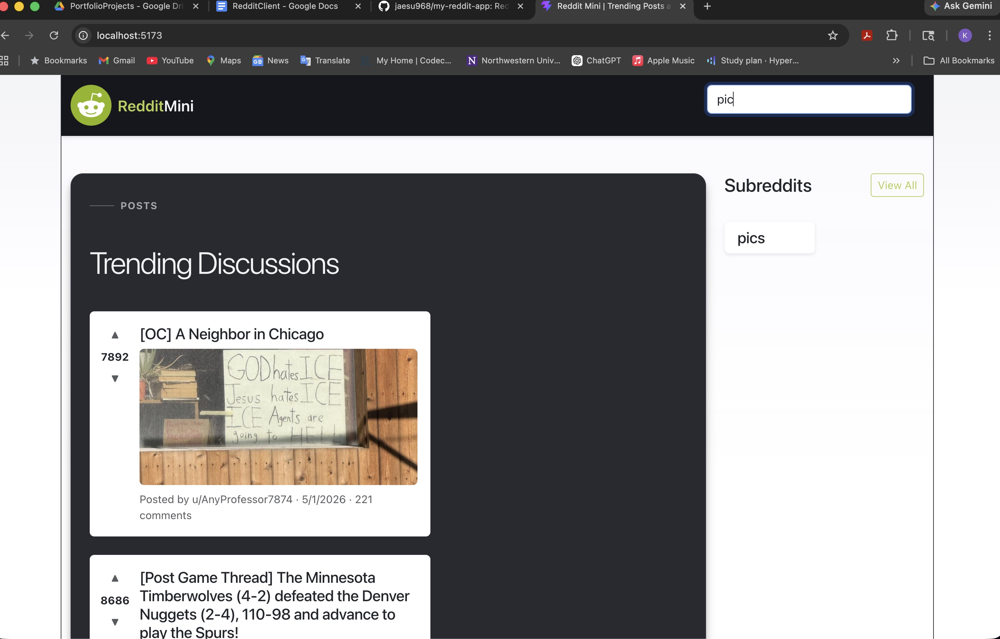

# Reddit Mini

A Reddit-style client built with React, Vite, Redux Toolkit, React Router, and Bootstrap. Browse Reddit's popular posts, explore subreddits, read comments, and search content — all in a responsive, animated UI.

## Wireframes

### Desktop


### Mobile


## Technologies Used

- HTML
- CSS
- JavaScript
- React 19
- Vite 8
- Redux Toolkit
- React Redux
- React Router
- Bootstrap 5
- React Bootstrap
- ESLint 9
- react-markdown
- remark-gfm
- rehype-raw
- Vitest + @testing-library/react

## Features

- Live Reddit API integration via Vite proxy (local) and Netlify OAuth proxy function (production)
- Browse top posts from Reddit's popular feed
- Browse and select subreddits — auto-loads posts for that community
- View post details with full markdown body rendering
- Comments loaded per post (top 10, with image support)
- Client-side upvote/downvote on posts
- Global search bar filters posts and subreddits simultaneously
- Paginated feed — shows 8 posts initially with a "Load more" button
- Optimised images — selects the smallest sufficient Reddit preview variant (~600px) to reduce bandwidth
- Lazy loading — off-screen post images load on demand; only the first post image is eagerly fetched
- Responsive layout — works desktop to mobile
- Error boundary — graceful fallback on render errors
- Animations — card hover lift, PostDetail slide-in, loading pulse, selection transitions

## Project Structure

- `src/app` - Redux store and root reducer
- `src/features` - feature-specific slices/components/pages/api stubs
- `src/shared` - shared UI components, API stubs, hooks, styles, and utilities
- `src/pages` - route-level pages

## Screenshots of Web App 
- `Desktop Screenshot`

- `Small Screen / Mobile Device size Screenshot`

- `Search Functionality Screenshot`


## Testing

### Lighthouse Audit Results

Audits were run against the production build (`npm run build` + `npm run preview`) using Lighthouse 13 in headless Chrome. Scores are the median of 3 runs.

| Category | Baseline | Final | Change |
|---|---|---|---|
| Performance | 74 | 80 | +6 |
| Accessibility | 100 | 100 | — |
| Best Practices | 100 | 100 | — |
| SEO | 100 | 100 | — |

**Performance improvements applied:**
- Replaced full-size Reddit source images with the smallest preview variant ≥ 600px wide
- Added `loading="lazy"` and `fetchpriority="low"` on all off-screen post images
- Added `fetchpriority="high"` and `loading="eager"` on the first (above-the-fold) post image
- Capped initial feed to 8 posts to reduce initial DOM size

> Note: Performance varies between runs because Reddit serves live media assets of unpredictable size and count. A score below 90 caused by third-party media is an accepted trade-off per the project brief.

### Unit Tests (Vitest)

Run component and slice unit tests:

```bash
npm test          # run all unit tests once
npm run test:watch  # watch mode
npm run test:ui     # Vitest browser UI
```

### E2E Tests (Playwright)

Three end-to-end tests covering core user flows:

- **Page load** — verifies post cards are visible on launch
- **Search filtering** — confirms no-results state with an unmatched query
- **Post selection** — clicks a post, asserts it becomes selected and detail content appears

```bash
npm run e2e           # run all E2E tests (headless, all browsers)
npm run e2e:headed    # run with visible browser window
npm run e2e:ui        # open Playwright interactive UI
npm run e2e:debug     # step through tests with Playwright debugger
```

> Playwright must have browsers installed: `npx playwright install`

---

## Getting Started

1. Install dependencies:
   ```bash
   npm install
   ```
2. Run the project:
   ```bash
   npm run dev      # development server
   npm run build    # production build
   npm run preview  # preview production build
   ```

## Possible Future Work 

- Remote Reddit search (beyond locally fetched data)
- Persistent vote state in Redux
- Nested comment threading
- OAuth login for real voting/posting
- Progressive Web App (PWA) support
- Route-level code splitting for improved initial load performance   